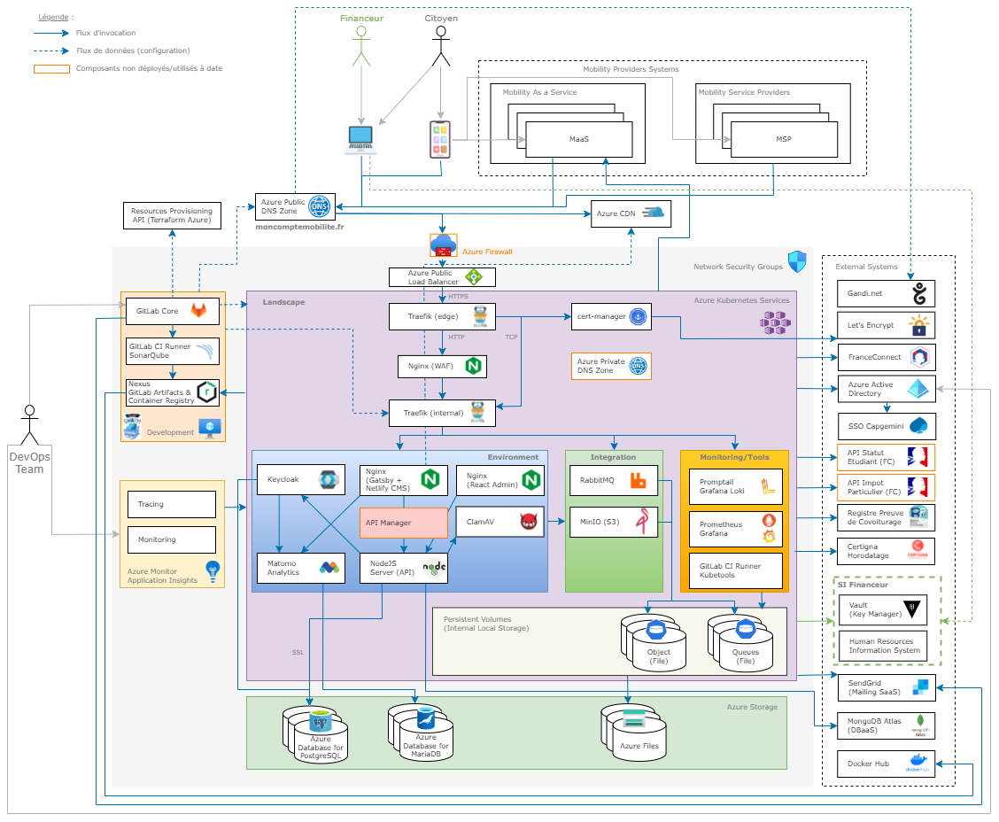

# Description

Le service api se base sur le framework **[Loopback 4](https://loopback.io/doc/en/lb4/)**

Ce service contient la logique métier backend. Il est essentiel au reste de l'applicatif et permet de relier tous les services entre eux.
Il s'appuie sur une base de données orientée documents **[MongoDB](https://www.mongodb.com/docs/v5.0/)**.

# Installation en local

## MongoDB

```sh
docker run -d --name mcm-mongo -p 27017:27017 -e MONGO_INITDB_ROOT_USERNAME=${MONGO_ROOT_USER} -e MONGO_INITDB_ROOT_PASSWORD=${MONGO_ROOT_PASSWORD} mongo
```

## LB4

Si vous voulez avoir plus de contrôle sur les variables de l'api, créez un fichier d'environnement à la racine (ex: .env) avec les variables mentionnées ci-dessous. Il faudra alors l'exécuter avant de lancer l'api.

```sh
yarn install && yarn start:watch
```

ou

`yarn install && yarn start`

## Variables

| Variables                      | Description                                                                  | Obligatoire |
| ------------------------------ | ---------------------------------------------------------------------------- | ----------- |
| API_KEY                        | Api Key en header des requêtes pour l'api                                    | Non         |
| AFFILIATION_JWS_KEY            | Clé jws utilisée pour signer le token d'affiliation citoyen à une entreprise | Non         |
| WEBSITE_FQDN                   | Url du website                                                               | Non         |
| LANDSCAPE                      | Nom de l'environnement (preview, testing ..)                                 | Non         |
| BASE_DOMAIN                    | Base domaine url                                                             | Non         |
| IDP_FQDN                       | Url de l'idp                                                                 | Non         |
| API_FQDN                       | Url de l'api                                                                 | Non         |
| CLIENT_SECRET_KEY_KEYCLOAK_API | Secret key du client API                                                     | Non         |
| PORT                           | Port de l'api                                                                | Non         |
| HOST                           | Host de l'api                                                                | Non         |
| CLAMAV_HOST                    | Host de l'antivirus                                                          | Non         |
| CLAMAV_PORT                    | Port de l'antivirus                                                          | Non         |
| MAILHOG_HOST                   | Host de mailhog                                                              | Non         |
| MAILHOG_EMAIL_FROM             | Email from 'mon compte mobilite'                                             | Non         |
| SENDGRID_HOST                  | Host sendgrid                                                                | Non         |
| SENDGRID_USER                  | User sendgrid                                                                | Non         |
| SENDGRID_API_KEY               | Api key sendgrid                                                             | Non         |
| SENDGRID_EMAIL_FROM            | Email from 'mon compte mobilite'                                             | Non         |
| BUS_HOST                       | Host Rabbitmq                                                                | Non         |
| BUS_MCM_CONSUME_USER           | Username pour la réception des messages                                      | Non         |
| BUS_MCM_CONSUME_PASSWORD       | Password pour la réception des messages                                      | Non         |
| BUS_MCM_HEADERS                | Header d'échange de publication                                              | Non         |
| BUS_MCM_MESSAGE_TYPE           | Message type d'échange de la publication                                     | Non         |
| BUS_CONSUMER_QUEUE             | Nom de la queue pour le consumer                                             | Non         |
| S3_SERVICE_USER                | User compte de service                                                       | Non         |
| S3_SERVICE_PASSWORD            | Password compte de service                                                   | Non         |
| S3_HOST                        | Host minio                                                                   | Non         |
| S3_PORT                        | Port minio                                                                   | Non         |
| IDP_DB_HOST                    | Host bdd pgsql                                                               | Non         |
| IDP_DB_PORT                    | Port bdd pgsql                                                               | Non         |
| IDP_DB_SERVICE_USER            | Username de service pgsql (readaccess)                                       | Non         |
| IDP_DB_SERVICE_PASSWORD        | Password de service pgsql (readaccess)                                       | Non         |
| IDP_DB_DATABASE                | Nom bdd pgsql                                                                | Non         |
| PGSQL_FLEX_SSL_CERT            | Certificat de connexion à la bdd pgsql en base 64                            | Non         |
| MONGO_SERVICE_USER             | User service bdd mongo                                                       | Non         |
| MONGO_SERVICE_PASSWORD         | Password service bdd mongo                                                   | Non         |
| MONGO_HOST                     | Host mongo                                                                   | Non         |
| MONGO_DATABASE                 | Nom de la bdd mongo                                                          | Non         |
| MONGO_PORT                     | Port mongo                                                                   | Non         |
| MONGO_AUTH_SOURCE              | Nom de la source d'authentification bdd mongo                                | Non         |
| SENDGRID_EMAIL_CONTACT         | Email contact                                                                | Non         |
| LOG_LEVEL                      | Niveau de logs pour l'api                                                    | Non         |

## URL / Port

- URL : localhost
- Port : 3000

# Précisions pipelines

L'image de l'api est basée sur celle de nginx.

La variable PACKAGE_VERSION (voir commons) permet de repérer la dernière version publiée.

## Preview

Deux scripts sont lancés au déploiement de la bdd mongo permettant de créer les collections et les index nécessaires et de créer l'utilisateur de service ayant seulement l'accès en lecture et écriture sur la bdd. (mongo/databaseConfig/createServiceUser.js & setup.js)

## Testing

Sur cet environnement, la bdd mongo est hébergée sur Azure. Le paramétrage de la bdd et des collections sont donc à faire en amont.

# Relation avec les autres services

Comme présenté dans le schéma global de l'architecture ci-dessous



L'api est reliée à tous les services que nous avons mis en place.

A son démarrage :

- Elle peut exécuter des scripts de migrations de la bdd mongo.
- Elle lance un child process étant responsable de l'écoute et de la consommation des événements amqp sur la queue de dépôt
- Elle se connecte aux bdd configurées (mongo & pgsql)

Comme mentionné, notre api a accès à la bdd pgsql de l'[idp](idp) en lecture seule permettant de requêter des informations plus rapidement & facilement que par appel API de l'IDP.

L'api est reliée à :

- _idp_ pour renforcer la sécurité et vérifier l'accès aux endpoints.
- _administration_ pour permettre la contribution de certains contenus.
- website pour la récupération des données permettant le bon fonctionnement de moB.
- _s3_ pour le download/upload des justificatifs
- simulation-maas pour la simulation de l'envoie des metadonnées. En effet, nos développements sont orientés open API et nos partenaires peuvent donc s'orienter sur une approche Full API de moB.
- _antivirus_ pour scanner les justificatifs qui nous sont envoyés.
- _bus_ pour l'échange de messages entre les SIRH et nous.

* Requêtes HTTP avec l'administration
* Requêtes HTTP avec l'idp
* Requêtes HTTP avec website
* Requêtes HTTP avec s3
* Requêtes HTTP avec simulation-maas
* Requêtes TCP avec antivirus
* Requêtes AMQP avec le bus

# Tests Unitaires

Les TU sont fait avec le framework de test Mocha.

Pour lancer les tests unitaires

```sh
yarn test
```
