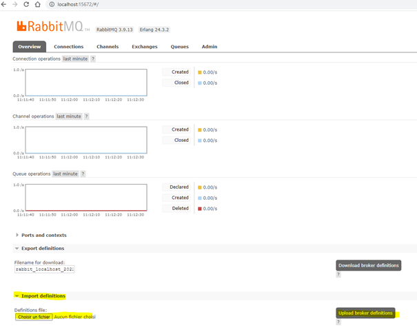

# Description

Le service bus se base sur la brique logicielle **[RabbitMQ](https://www.rabbitmq.com/)**

Cette brique de message broker nous permet de communiquer avec les SIRH sur le sujet des demandes d'aides effectuées par un citoyen.

Nous utilisons le protocol amqp pour échanger des messages.

L'authentification via oAuth2 a été activée pour les environnements distants permettant ainsi d'utiliser un jeton d'authentification émis par notre IDP pour pouvoir publier ou consommer des messages.

L'utilisation du fichier 'definition.json' présent dans le dossier overlays permet de définir les configurations nécessaires au bon fonctionnement de l'échange des messages. 

(Voir relation avec les autres services)

# Installation en local

`docker run -d --name rabbitmq -p 15672:15672 -p 5672:5672 -e RABBITMQ_USERNAME=${BUS_ADMIN_USER} -e RABBITMQ_PASSWORD=${BUS_ADMIN_PASSWORD} bitnami/rabbitmq:latest`

Récupérer le fichier overlays/definition.json

## Variables

| Variables      | Description | Obligatoire |
| ----------- | ----------- | ----------- |
| BUS_ADMIN_USER      | Username pour la connexion au portail       | Oui |
| BUS_ADMIN_PASSWORD   | Password pour la connexion au portail        | Oui |
| BUS_MCM_CONSUME_USER   | Username pour la réception des messages        | Oui |
| BUS_MCM_CONSUME_PASSWORD   | Password pour la réception des messages        | Oui |
| IDP_API_CLIENT_SECRET   | Client secret du client confidentiel IDP pour l'API | Oui |
| CAPGEMINI_SECRET_KEY   | Client secret du client confidentiel CAPGEMINI pour l'API        | Non |

Importer, via l'interface RabbitMQ, le fichier definition.json  modifié avec les valeurs de variables mentionnées ci-dessus.

## URL / Port

Portail d'admin :
- URL : localhost
- Port : 15672

Node port :
- URL : localhost
- Port : 5672

# Précisions pipelines

## Preview

Pas de précisions nécéssaires pour ce service

## Testing

Le fichier definition.json n'est pas importé au déploiement. Il faudra l'importer manuellement comme précisé pour l'installation locale.

Le deploiement du bus est de type statefulSet.

# Relation avec les autres services

Comme présenté dans le schéma global de l'architecture ci-dessus (# TODO)

L'api possède un child process qui au démarrage de l'application permet d'écouter les messages provenant de rabbitmq sur la queue de consommation.

L'api effectue une requête amqp pour envoyer les données de souscriptions sur la queue de publication.

**Bilan des relations:**

- Consommation des messages
- Publication de messages

# Tests Unitaires

Pas de tests unitaires nécéssaires pour ce service

