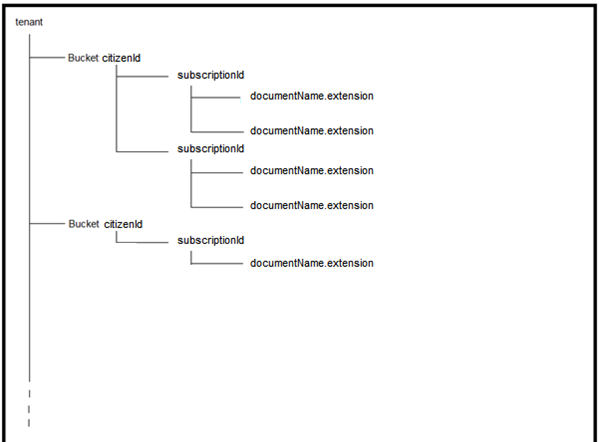

# Description

Le service s3 se base sur la brique logicielle **[MinIO](https://min.io/)**

Elle est s3-compliant et permet de stocker les fichiers que moB peut être amené à recevoir de la part des citoyens dans les souscriptions déposées.
Ainsi, ce sont les fonctions AWS S3 pour créer des buckets, uploader, downloader des fichiers ...

Les documents stockés sont tous encryptés avant écriture par le service [api](api), au moyen de la clé publique RSA paramétrée active sur le financeur de l'aide (incentive).

L'architecture des buckets choisie est la suivante :



# Installation en local

```sh
docker run --name minio -p 9001:9000 minio/minio:RELEASE.2021-06-17T00-10-46Z server /data
```

⚠ la version minio de l'image de minio n'est pas iso environnement preview & testing

Son installation en local n'est pas requise mais permet de faciliter le parcours fonctionnel pour quelqu'un ne connaissant pas toutes les fonctionnalités de notre produit.

Si vous ne l'installez pas, une erreur sera remontée lorsque vous essayerez d'uploader/downloader des justificatifs via l'api.

L'ajout du compte de service n'est pas nécessaire en local, mais obligatoire sur les environnements distants.

En local, c'est le compte d'admin qui peut être utilisé par l'api.

## Variables

| Variables           | Description                        | Obligatoire |
| ------------------- | ---------------------------------- | ----------- |
| S3_SERVICE_USER     | Username pour le compte de service | Oui         |
| S3_SERVICE_PASSWORD | Password pour le compte de service | Oui         |
| S3_SUPPORT_USER     | Username pour le compte de support | Non         |
| S3_SUPPORT_PASSWORD | Password pour le compte de support | Non         |

- Compte de service : ReadWrite
- Compte de support : Diagnostics

## URL / Port

- URL : localhost
- Port : 9001

# Précisions pipelines

## Preview

Un job K8S _s3mc_ est lancé au déploiement pour créer les comptes de service et de support.

## Testing

L'ajout des comptes de service et de support est à faire manuellement via l'interface avec les droits mentionnés dans l'installation locale.

Le déploiement de s3 dans K8S est de type statefulSet.

# Relation avec les autres services

Comme présenté dans le [schéma d'architecture détaillée](docs/assets/MOB-CME_Archi_technique_detaillee.png) :


L'api effectue une requête HEAD HTTP vers s3 pour vérifier l'existence du bucket (voir achitecture bucket mentionnée au début du fichier).

- api effectue une requête HEAD HTTP vers s3 pour vérifier l'existence du bucket (voir architecture des buckets mentionnée plus haut).
- api effectue une requête POST HTTP vers s3 pour créer le bucket s'il n'est pas déjà existant.
- api effectue une requête POST HTTP vers s3 pour uploader les fichiers dans le bucket associé.
- api effectue une requête GET HTTP vers s3 pour récupérer les fichiers afin qu'ils soient visualisables via [website](website).

**Bilan des relations:**

- Requête HTTP de _api_ vers _s3_ pour vérifier existence du bucket
- Requête HTTP de _api_ vers _s3_ pour créer le bucket associé s'il n'existe pas
- Requête HTTP de _api_ vers _s3_ pour enregistrer le fichier
- Requête HTTP de _api_ vers _s3_ pour télécharger le fichier

# Tests Unitaires

Pas de tests unitaires nécéssaires pour ce service
